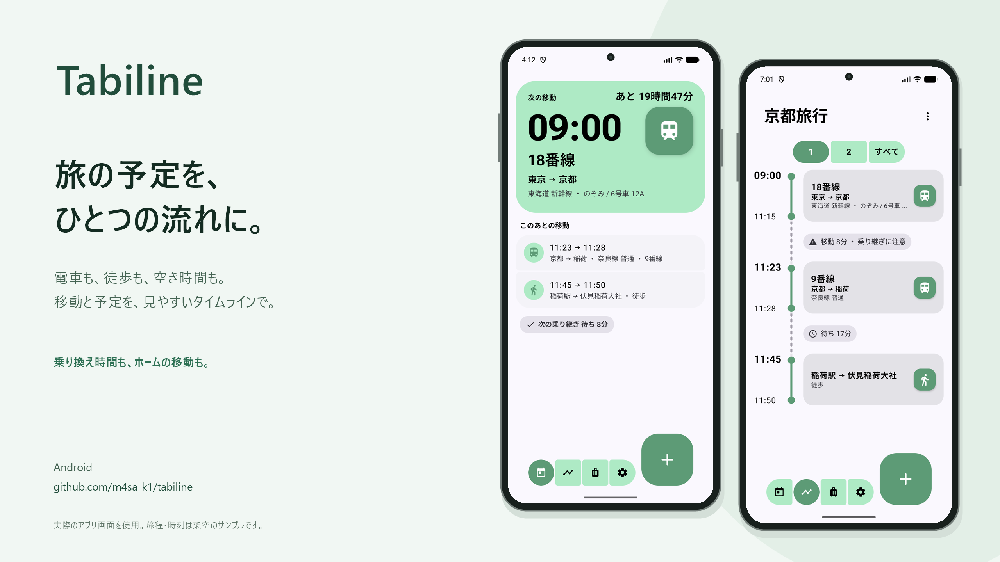

  

<h1 align="center">Tabiline</h1>

> **旅の移動を、一本の線に。** 
> 電車・飛行機・船・バス・徒歩まで、旅行中の「次どう動く？」がひと目で分かるAndroidアプリです。

  

実際のアプリ画面を使用しています。旅程・時刻は架空のサンプルです。 Actual app screenshots with a fictional sample itinerary and times.

## 🇯🇵 日本語

### ✨ Tabilineとは

旅行中に本当に素早く見たいのは、**次の出発時刻・乗り場・行き先**。Tabilineは観光地やホテルの管理をあえて詰め込まず、移動情報だけを読みやすい一本のタイムラインへまとめます。

大きな時刻表示、交通手段ごとのアイコン、乗り継ぎ時間の自動計算、片手で扱いやすい操作を組み合わせた、旅行中のための交通プランナーです。Material 3 Expressiveを基調に、ライト／ダークテーマと豊富なアクセントカラーにも対応しています 🎨

### 🌟 できること

- 🕒 **「今日」を即確認** — 次の移動、乗り場、経路を大きく表示。出発まで1時間未満なら秒単位でカウントダウン
- 🧵 **一本のタイムライン** — 日別・「すべて」を切り替え。夜行便は通過する各日に表示し、前・翌・翌々の時刻で整理
- 🔎 **タップで詳細** — 詳細ポップアップから編集・削除へ。未保存の入力を閉じるときは確認します
- ✈️ **フライト情報** — 出発・到着のターミナルとゲート、搭乗Group、便番号を保存。一覧は出発側の情報を表示
- 🔔 **出発前にお知らせ** — 設定から任意で有効化し、交通手段ごとに通知時間を指定
- 🚉 **幅広い移動手段** — 電車、飛行機、船、バス、徒歩、その他に対応
- ☕ **空き時間も予定化** — 用事名と時間を、移動と同じ流れの中で管理
- 🔁 **乗り継ぎを見える化** — 待ち時間を自動計算し、「待ち」「移動」を選択可能
- ⚠️ **短い乗り継ぎを警告** — 設定した基準より短い接続を分かりやすく表示
- 🧳 **旅行ごとに整理** — 進行中・これから・終了した旅行を一覧表示
- 📅 **旅行なしでも登録** — 単独の予定は日付名のスケジュールとして自動整理
- 🎨 **気分に合う見た目** — ライト／ダーク／端末設定、複数のアクセントカラー
- 🌏 **タイムゾーン対応** — 標準は東京。設定から旅行先に合わせて変更可能
- 📴 **完全オフライン** — アカウント登録も通信も不要。データは端末内に保存

### 🧭 4つの画面

| 画面 | 役割 |
|---|---|
| **今日** | 直近の移動を最優先で表示。残り時間と乗り場をすぐ確認できます。 |
| **タイムライン** | 旅行全体を日ごとに確認。待ち時間や乗り継ぎも一本の線で追えます。 |
| **旅行** | 進行中・予定・終了済みの旅行と、単独スケジュールをまとめて管理します。 |
| **設定** | テーマ、アクセントカラー、標準タイムゾーン、アプリ情報を変更できます。 |

タイムライン上部はスクロール時に背後がぼけ、下端へ自然に透明になります。最上部ではぼかしをかけません。移動追加はシンプルな上下スライドで開閉します。

### 📝 登録できる情報

- 出発時刻・到着時刻
- 出発地・到着地
- 交通手段
- 電車の路線名と種別（特急・急行・快速・普通・新幹線など）
- ホーム番号、ゲート番号、バースなどの乗り場
- 飛行機の出発・到着ターミナル／ゲート、搭乗Group、便番号
- 列車名・便名、座席、予約番号などのメモ
- 空き時間の用事名と開始・終了時刻

### 📲 インストール

1. [最新のReleasesページ](https://github.com/m4sa-k1/tabiline/releases/latest)を開きます。
2. `tabiline-x.x.x.apk`をダウンロードします。
3. Androidの案内に従い、利用したブラウザまたはファイル管理アプリへ「不明なアプリのインストール」を許可します。
4. APKを開いてインストールすれば完了です。さあ、次の旅を一本の線にまとめましょう！ 🚀

> [!TIP]
> 同じ公式署名の新しいAPKを上書きインストールすると、通常は登録済みデータを残したまま更新できます。

### 🚀 はじめかた

1. **旅行**タブで「新しい旅行」を作成します。
2. 大きな追加ボタンから最初の移動を登録します。
3. 旅行当日は**今日**タブを開くだけ。次の出発が大きく表示されます。
4. 旅程全体を見たいときは**タイムライン**へ。日付ボタンで日ごとに切り替えられます。

旅行がまだ決まっていなくても大丈夫です。移動を旅行へ紐づけずに登録すると、日付を名前にした単独スケジュールとして旅行一覧に現れます。日をまたぐ予定にも対応します。

### 🎛️ 自分好みにカスタマイズ

- **テーマ**：ライト、ダーク、端末設定に合わせる
- **アクセントカラー**：Purple、Blue、Green、Coral、Amber、Teal、Monoなど
- **アプリアイコン**：Green、Purple、Blue、Teal、Coral、Monoの6色。変更時にアプリを自動で開き直し、起動アニメーションも同じ色に。アプリ内のアクセントカラーとは別設定です
- **標準タイムゾーン**：初期値は東京。登録時の基準地域を変更可能
- **乗り継ぎ警告**：短いと判断する待ち時間の基準を調整

### 🔔 出発前の通知（任意）

設定 → **出発通知**でオンにし、交通手段ごとに何分前に通知するか選べます（初期状態はオフ、0分は出発時刻）。通知をタップすると「今日」が開きます。空き時間は開始前の通知です。

Androidの通知許可が必要です。「正確なアラーム」が未許可の場合や端末の省電力設定によって通知が遅れることがあります。設定済みの通知時刻を過ぎた予定は通知せず、移動の編集・削除や通知設定の変更で予約を更新します。端末再起動後も未来の通知を再登録します。アプリを強制停止した場合は再度開いてください。大切な出発は通知だけに頼らず確認してください。

### ☕ 開発を応援する

設定の独立した「開発者を応援する」カードから、ブラウザで[Ko-fi](https://ko-fi.com/m4sak1)を開いて任意の支援ができます。支援の有無でアプリの機能は変わりません。

アプリ内にKo-fiのコンテンツは読み込みません。旅行データをKo-fiへ渡すこともありません。ブラウザでのログイン・決済には各サービスの規約・プライバシーポリシーが適用されます。

### 🔒 データとプライバシー

Tabilineはアカウントを要求せず、旅行・移動・設定データを端末内に保存します。これらの情報をTabilineが外部サーバーへ送信することはありません。

ただし、Androidのバックアップ機能は有効です。端末の設定により、旅行・移動データなどがOSによってGoogle Driveなどへバックアップされたり、新しい端末へ転送されたりする場合があります。これはTabiline独自のクラウド同期ではありません。バックアップの管理は端末の設定で行ってください。

### 💾 手動バックアップ・復元

**設定 → バックアップ**から、旅行・移動・空き時間と設定を `.tabiline` ファイルに保存できます。Androidのファイル選択画面で保存先を選びます。対応する保存サービスがあればクラウドにも保存でき、アプリ内で最終保存日時を確認できます。

復元前にファイルを検証し、作成日時と旅行・予定の件数を表示します。設定も復元するか選択できます。通知の許可とアプリアイコンの色は対象外です。未来の通知は再設定し、過去の通知は送信しません。

> [!WARNING]
> **復元すると現在の旅行・移動・空き時間はすべて上書きされます。事前にバックアップしていない既存データは、復元後に取り戻せません。** 警告を確認してチェックを入れるまで復元できません。現在のデータを残したい場合は、必ず先に別のファイルへ保存してください。

ファイルは暗号化されず、メモや予約情報も含まれます。安全な場所に保管してください。破損・未対応のファイルでは既存データを置き換えません。上限は10MBです。この機能は手動保存であり、自動クラウド同期ではありません。

> [!IMPORTANT]
> アプリを削除すると端末内のデータも失われる場合があります。予約番号や航空券などの重要情報は、必ず別の安全な場所にも保管してください。

### 📱 対応環境

- Android 8.0（API 26）以降
- スマートフォン向け
- 旅行の管理はオフライン対応（ブラウザでのKo-fi利用にはインターネット接続が必要）
- 高リフレッシュレート端末の滑らかなアニメーションに対応

### 🛠️ 困ったとき

- **インストールできない**：古いAPKと署名が異なる場合があります。必要なデータを確認してから旧版を削除し、公式ReleasesのAPKをお試しください。
- **文字や表示が崩れる**：端末を再起動し、最新リリースへ更新してください。
- **次の移動が出ない**：予定の日付、時刻、タイムゾーン、旅行期間をご確認ください。
- **更新後も古い表示になる**：アプリ情報からインストール済みバージョンを確認してください。

解決しない場合や新しいアイデアがある場合は、[GitHub Issues](https://github.com/m4sa-k1/tabiline/issues)へどうぞ 💬 端末名、Androidバージョン、Tabilineのバージョン、再現手順、可能であればスクリーンショットを添えると調査がスムーズです。予約番号や氏名などの個人情報は投稿しないでください。

### 📜 権利・ライセンス

Tabiline本体のソースコード、デザイン、画像、文書などの権利は、第三者素材を除き **@m4sa-k1** が留保します。公式APKは個人的かつ非商用の目的で利用できます。ソースコードやAPKの複製、改変、再配布、販売などには、権利者の事前の書面による許可が必要です。詳細は[LICENSE](LICENSE)をご確認ください。

🌐 作者のWebサイト：[https://m4sak1.me](https://m4sak1.me)

公開リポジトリの閲覧・GitHub上でのフォークなど、GitHub利用規約または適用法令で認められる利用は上記制限の例外です。公開は、一般的な改変・再配布・商用利用の許可を意味しません。

ライブラリの構成と同梱通知は[第三者コンテンツ一覧](app/src/main/assets/third_party_licenses/DEPENDENCIES.md)をご確認ください。

Roboto FlexとNoto Sans JPは、Tabiline本体とは別にSIL Open Font License 1.1の条件で使用しています。各ライセンス全文は[第三者ライセンス](app/src/main/assets/third_party_licenses)にあります。フォントのOFLはTabiline本体をオープンライセンスにするものではありません。

背景ぼかしにはApache License 2.0のHazeを使用しています。Androidのバージョンによってはグラデーション表示に切り替わります。

---

## 🇬🇧 English

### ✨ What is Tabiline?

While travelling, the details you need fastest are simple: **when to leave, where to board, and where you are going**. Tabiline deliberately focuses on transport and arranges every journey on one clear timeline.

Large time displays, mode-specific icons, automatic connection calculations, and one-handed controls make Tabiline a transport planner built for the moment you are actually on the move. Its Material 3 Expressive interface supports light and dark themes plus a collection of accent colors 🎨

### 🌟 Highlights

- 🔔 **Optional departure reminders** — enable in Settings → departure notifications (off by default), choose a lead time per transport mode, and tap a notification to open Today. Zero minutes means departure time; free-time entries use their start time. Notification permission is required. Without exact-alarm access, or under battery restrictions, reminders may be delayed. Past reminder times are skipped; future reminders are updated after edits and restored after reboot. Reopen the app after force-stopping it, and do not rely solely on notifications for important departures.

- 🕒 **Today at a glance** — see the next journey, platform and route, with a seconds countdown below one hour
- 🧵 **One continuous timeline** — switch between individual days and All; overnight journeys appear on each day they span with relative-day time labels
- 🔎 **Details first** — tap an entry for a detail popup, then edit or delete; discarding unsaved trip or journey changes requires confirmation
- ✈️ **Flight details** — save both terminals and gates, boarding group and flight number; lists show departure-side boarding information
- 🚉 **Many transport modes** — train, flight, ferry, bus, walking, and other
- ☕ **Free-time entries** — place activities and breaks naturally between journeys
- 🔁 **Clear connections** — calculate gaps automatically and mark them as waiting or moving
- ⚠️ **Short-connection warnings** — highlight gaps below your chosen threshold
- 🧳 **Trip organization** — separate active, upcoming, and completed trips
- 📅 **Standalone plans** — save transport without a trip under an automatic date-based schedule
- 🎨 **Personal themes** — light, dark, system theme, and multiple accent palettes
- 🌏 **Time-zone aware** — Tokyo by default, adjustable for your destination
- 📴 **Fully offline** — no account and no network required; data stays on your device

### 🧭 Four focused screens

| Screen | Purpose |
|---|---|
| **Today** | Prioritizes your nearest journey, countdown, and boarding location. |
| **Timeline** | Shows the complete trip by day, including waits and connections. |
| **Trips** | Organizes active, upcoming, completed, and standalone schedules. |
| **Settings** | Controls theme, accent color, default time zone, and app information. |

### 📝 Details you can save

- Departure and arrival times
- Origin and destination
- Transport mode
- Train line name and service type, such as limited express, rapid, local, or Shinkansen
- Platform, gate, berth, or another boarding location
- Departure/arrival airport terminals and gates, boarding group, and flight number
- Train/flight name, seat, booking reference, and other notes
- Activity name and start/end time for free-time entries

### 📲 Installation

1. Open the [latest Releases page](https://github.com/m4sa-k1/tabiline/releases/latest).
2. Download `tabiline-x.x.x.apk`.
3. Follow Android's prompt to allow your browser or file manager to install unknown apps.
4. Open the APK and install it. Your next trip is ready to become one clear line! 🚀

> [!TIP]
> Installing a newer APK with the same official signature will normally update Tabiline while preserving local data.

### 🚀 Getting started

1. Create a trip from the **Trips** tab.
2. Use the large add button to enter your first journey.
3. On the travel day, open **Today** to see the next departure immediately.
4. Open **Timeline** to browse the full itinerary and switch between trip days.

No trip yet? Save the journey without assigning it. Tabiline creates a standalone, date-named schedule in the Trips list, including support for overnight journeys.

### 🎛️ Make it yours

- **Theme:** light, dark, or follow the device
- **Accent color:** Purple, Blue, Green, Coral, Amber, Teal, Mono, and more
- **App icon:** Green, Purple, Blue, Teal, Coral, or Mono. Changing it automatically reopens the app and also colors the launch animation; this is independent of the in-app accent palette. Launchers may take a moment to refresh the icon.
- **Default time zone:** Tokyo initially; choose the region used for new entries
- **Connection warning:** adjust the threshold for a tight connection

### 🔒 Data and privacy

Tabiline requires no account. Trip, journey, and preference data is stored locally on your device, and Tabiline does not send it to an external server.

Android backup is enabled. Depending on device settings, the operating system may back up trip and journey data to a service such as Google Drive or transfer it to another device. This is separate from app-operated cloud synchronization. Manage backups in your device settings.

### 💾 Manual backup and restore

Open **Settings → Backup** to save trips, journeys, free-time entries and preferences in a `.tabiline` file. Choose a location using Android's file picker; cloud storage is available when its provider supports it. The popup shows the last successful export time.

Before restoring, Tabiline validates the file and shows its creation time and entry counts. Restoring preferences is optional. Notification permissions and launcher-icon color are not included. Future reminders are rescheduled; past reminders are not sent.

> [!WARNING]
> **Restoring replaces ALL existing trips and entries. Existing data cannot be recovered unless you backed it up beforehand.** Read the warning and check the confirmation box before proceeding. Save a separate backup first if you want to keep your current data.

Backup files are not encrypted and may include notes and reservation details. Store them securely. Invalid or unsupported files are rejected without replacing your data. The maximum file size is 10 MB. This feature is manual backup, not automatic cloud synchronization.

### ☕ Support development

Tap the separate **Support the developer** card in Settings to open [Ko-fi](https://ko-fi.com/m4sak1) in your browser. Contributions are optional and do not unlock or change app features.

The app does not embed Ko-fi content or pass trip data to Ko-fi. The services' terms and privacy policies apply to login and payment in your browser.

> [!IMPORTANT]
> Uninstalling the app may remove its local data. Keep booking references, tickets, and other critical information in another secure place as well.

### 📱 Requirements

- Android 8.0 (API 26) or later
- Designed for smartphones
- Trip management works offline; using Ko-fi in your browser requires internet access
- Smooth animation support on high-refresh-rate displays

### 🛠️ Help and feedback

- **Cannot install:** an older APK may use a different signature. Check your important data, then try the official APK from Releases.
- **Text or layout looks wrong:** restart the device and update to the latest release.
- **No next journey appears:** check the date, time, time zone, and trip period.
- **Old UI remains after updating:** check the installed version in Android's app information.

For unresolved problems and feature ideas, visit [GitHub Issues](https://github.com/m4sa-k1/tabiline/issues) 💬 Include the device model, Android version, Tabiline version, reproduction steps, and a screenshot when possible. Never post personal data such as names or booking references.

### 📜 Rights and licenses

Except for identified third-party materials, all rights in the Tabiline source code, design, artwork, and documentation are reserved by **@m4sa-k1**. The official APK may be used for personal, non-commercial purposes. Copying, modifying, redistributing, or selling the source code or APK requires the rights holder's prior written permission. See [LICENSE](LICENSE) for the full terms.

🌐 Author's website: [https://m4sak1.me](https://m4sak1.me)

Uses permitted by applicable law or GitHub's Terms of Service, including viewing and forking through GitHub, are exceptions to these restrictions. Public availability does not grant general modification, redistribution, or commercial-use rights.

See the [third-party component inventory](app/src/main/assets/third_party_licenses/DEPENDENCIES.md) for library versions and bundled notices.

Roboto Flex and Noto Sans JP are used separately under the SIL Open Font License 1.1. Their complete license texts are stored under [Third-party licenses](app/src/main/assets/third_party_licenses). The fonts' OFL terms do not make Tabiline itself open source.

Background blur uses Haze under Apache License 2.0, with a gradient fallback on older Android versions. The timeline header fades its blur into the content while scrolling; blur is disabled at the very top. The add-journey screen uses a simple vertical slide transition.
